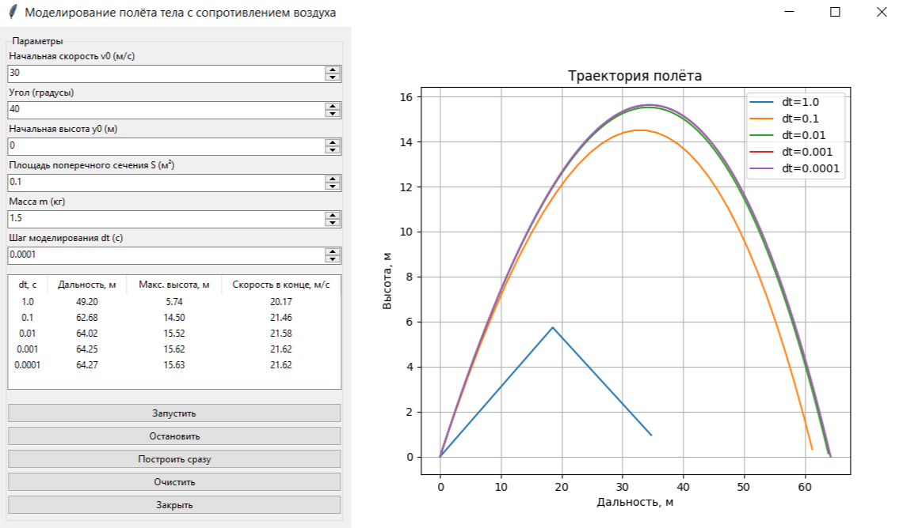

### Моделирование полёта тела в атмосфере

**Задание:**  
Реализовать приложение для моделирования полёта тела в атмосфере.  
Предусмотреть возможность ввода шага моделирования и вывода результатов.

Выполнить моделирование **без очистки предыдущих результатов** для различных шагов моделирования, сравнить траектории и заполнить таблицу.

**Начальные параметры:**
* Начальная скорость - 30 м/с;
* Угол - 40°;
* Начальная высота - 0 м;
* Площадь поперечного сечения - 0.1 м²;
* Масса - 1.5 кг.

| Шаг моделирования, с | 1 | 0.1 | 0.01 | 0.001 | 0.0001 |
|----------------------|---|-----|------|-------|--------|
| Дальность полёта, м | 49.2 | 62.68 | 64.02 | 64.25 | 64.27 |
| Максимальная высота, м | 5.74 | 14.5 | 15.52 | 15.62 | 15.63 |
| Скорость в конечной точке, м/с | 20.17 | 21.46 | 21.58 | 21.62 | 21.62 |

**Пример работы программы**

.

**Выводы:**

* По мере уменьшения шага моделирования результаты расчётов постепенно сходятся: траектории для шагов 0.01 с, 0.001 с и 0.0001 с практически совпадают, а изменения числовых характеристик становятся минимальными;

* При больших шагах (например, 1 с) численная погрешность существенна, что искажает траекторию полёта;

* Начиная с шага 0.01 с результаты меняются незначительно, что указывает на достижение баланса между точностью и вычислительными затратами;

* Существенным недостатком использования слишком малого шага моделирования является рост времени вычислений. При значениях 0.001 с и особенно 0.0001 с число итераций резко увеличивается, из-за чего моделирование выполняется заметно дольше без существенного прироста точности.

