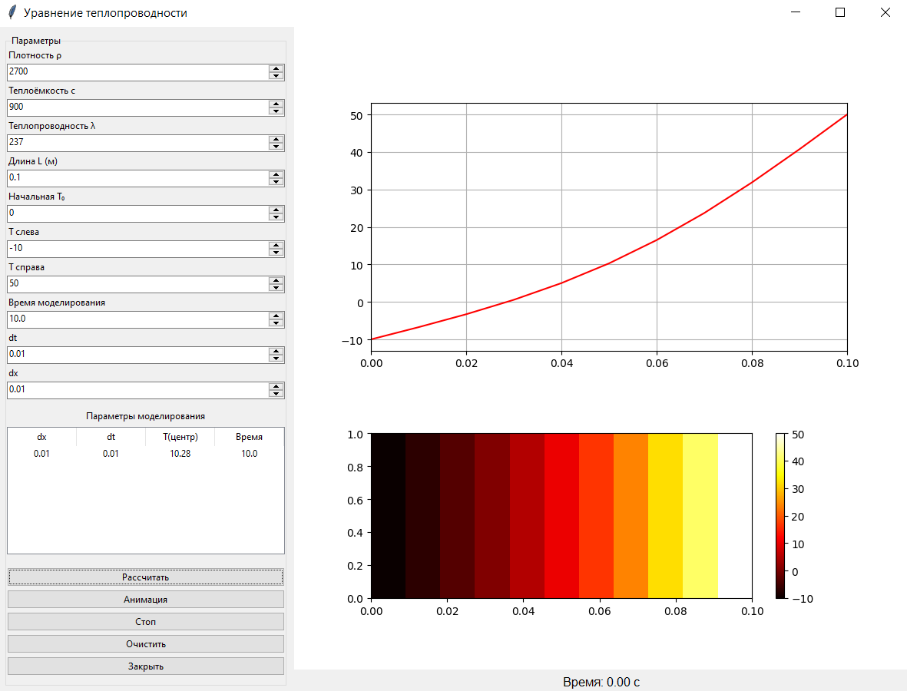

### Метод конечных разностей для уравнения теплопроводности

**Задание:**  
Реализовать моделирование изменения температуры в пластине на основе одномерного уравнения теплопроводности с использованием метода конечных разностей.

Выполнить моделирование с различными шагами по времени и по пространству.  
Заполнить таблицу значений температуры в центральной точке пластины после 2 секунд модельного времени.

**Начальные параметры:**
* Плотность материала (ρ) - 2700 кг/м³ (алюминий);
* Теплоёмкость (c) - 900 Дж/(кг·К);
* Теплопроводность (λ) - 237 Вт/(м·К);
* Длина пластины (L) - 0.1 м;
* Начальная температура (T₀) - 0°C;
* Температура на левой границе (T_left) - -10°C;
* Температура на правой границе (T_right) - 50°C;
* Время моделирования - 10 с.

| Шаг по времени, с \ Шаг по пространству, м | 0.1 | 0.01 | 0.001 | 0.0001 |
|-------------------------------------------|-----|------|-------|--------|
| 0.1 | -10.0 | 10.24 | 10.23 | 10.23 |
| 0.01 | -10.0 | 10.28 | 10.27 | 10.27  |
| 0.001 | -10.0 | 10.28 | 10.28 | 10.28 |
| 0.0001 | -10.0 | 10.28 | 10.28  | 10.28 |

**Пример работы программы**

.

**Выводы:**
* При пространственном шаге dx = 0.1 м (всего 2 узла внутри пластины) решение во всех случаях даёт -10.0°C. Это связано с тем, что при таком шаге центральный узел фактически отсутствует — сетка состоит только из граничных точек, и метод не может корректно описать распределение температуры внутри пластины.
* Переход к шагу dx = 0.01 м даёт качественное изменение результата (температура в центре 10.23-10.28°C), что указывает на достаточную детализацию пространственной сетки. Дальнейшее уменьшение dx до 0.001 м и 0.0001 м практически не меняет результат (изменения в сотых долях градуса), что говорит о сходимости решения по пространству.
* При минимальном пространственном шаге (dx = 0.1 м) временной шаг не влияет на результат - все значения равны -10.0°C из-за уже недостаточности пространственной сетки. Для пространственных шагов dx = 0.01 м и 0.001 м наблюдается слабая зависимость от dt: dt = 0.1 с даёт результат около 10.23-10.24°C, dt = 0.01-0.0001 с даёт результат около 10.27-10.28°C. Разница между результатами при разных dt составляет всего ~0.04°C, что указывает на быструю сходимость по времени.

