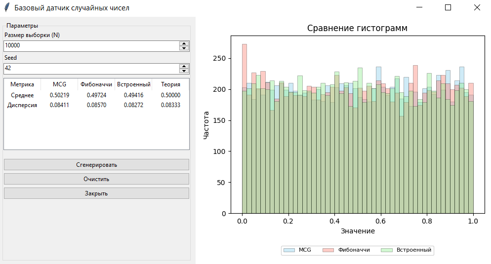

### Базовый датчик случайных чисел

**Задание:**
- реализовать базовый датчик случайных чисел;
- вычислить выборочные среднее и дисперсию:
  - для реализованного датчика;
  - для встроенного генератора языка программирования;
- размер выборки — **100 000 значений**;
- сравнить результаты с теоретическими;
- сделать вывод.

### Описание методов

**MCG (Мультипликативный конгруэнтный генератор)**  
Формула: `Xₙ₊₁ = (a · Xₙ) mod m`  
Параметры: `a = 16807`, `m = 2³¹ − 1`

**LCG (Линейный конгруэнтный генератор)**  
Формула: `Xₙ₊₁ = (a · Xₙ + c) mod m`  
Параметры: `a = 1664525`, `c = 1013904223`, `m = 2³²`  

**Встроенный генератор (NumPy)**
Используется как эталон качества

**Теоретические значения**  
- Среднее: 0.5  
- Дисперсия: 1/12 ≈ 0.08333

### Результаты (N = 100 000, seed = 42)

| Метрика | MCG | LCG | Встроенный | Теория |
|---------|-----|-----|-----------|--------|
| Среднее | 0.49832 | 0.50124 | 0.49949 | 0.50000 |
| Дисперсия | 0.08338 | 0.08305 | 0.08314 | 0.08333 |

**Пример работы программы**

.

### Выводы

1. Все три генератора показывают хорошее соответствие теоретическому равномерному распределению: отклонения среднего не превышают 0.002, дисперсии — 0.0003.

2. Наименьшие отклонения от теории демонстрирует встроенный генератор, что обусловлено использованием более совершенных алгоритмов.
