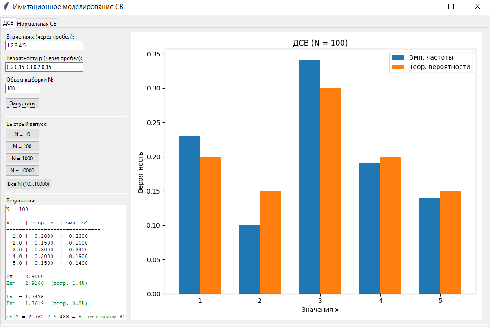
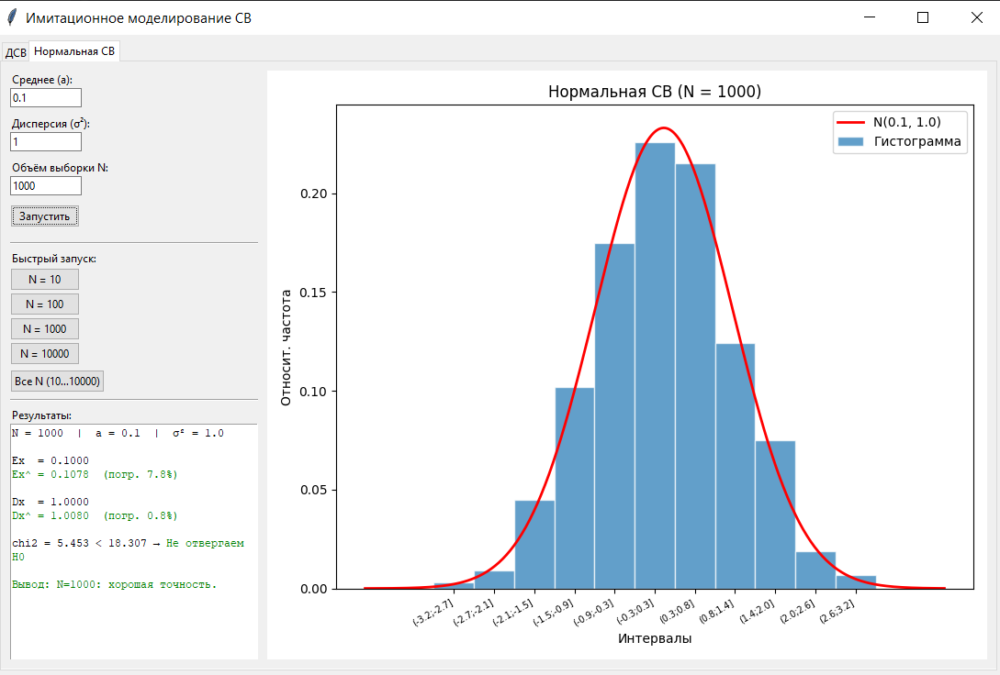

# Моделирование случайных величин (GUI)

## Цель работы

Разработать графическое приложение для имитационного моделирования дискретных и непрерывных случайных величин, провести статистическую обработку результатов и проверить соответствие эмпирического распределения теоретическому при различных объёмах выборки $N$.

## Лабораторная 6.1. Дискретная случайная величина (ДСВ)

### Постановка задачи

Задана дискретная случайная величина $\xi$ рядом распределения:

| $x_i$ | $x_1$ | $x_2$ | $\dots$ | $x_m$ |
|--------|--------|--------|---------|--------|
| $p_i$ | $p_1$ | $p_2$ | $\dots$ | $p_m$ |

где выполняется условие нормировки:

$$\sum_{i=1}^{m} p_i = 1$$

В эксперименте использовалось следующее распределение:

| $x_i$ | 1 | 2 | 3 | 4 | 5 |
|--------|------|------|------|------|------|
| $p_i$ | 0.20 | 0.15 | 0.30 | 0.20 | 0.15 |

Теоретические характеристики: $\mathbb{E}[x] = 2.95$, $\mathbb{D}[x] = 1.7475$.

### Метод моделирования — метод накопленных вероятностей

Для генерации одного значения ДСВ используется базовый датчик $\alpha \in [0, 1]$.

Единичный отрезок разбивается на $m$ интервалов, длины которых равны вероятностям $p_i$. Значение $x_k$ выбирается тогда, когда:

$$\sum_{i=1}^{k-1} p_i < \alpha \le \sum_{i=1}^{k} p_i$$

**Алгоритм:**

$$A := \alpha$$
$$A := A - p_k, \quad k = 1, 2, \dots$$
$$\text{если } A \le 0 \Rightarrow \text{результат } x_k$$

### Статистическая обработка результатов

По выборке объёма $N$ вычисляются эмпирические вероятности:

$$\hat{p}_i = \frac{n_i}{N}$$

где $n_i$ — число появлений значения $x_i$ в выборке.

**Теоретическое математическое ожидание и дисперсия:**

$$\mathbb{E}[x] = \sum_{i=1}^{m} p_i x_i, \qquad \mathbb{D}[x] = \sum_{i=1}^{m} p_i x_i^2 - \left(\mathbb{E}[x]\right)^2$$

**Выборочные оценки:**

$$\hat{\mathbb{E}}[x] = \sum_{i=1}^{m} \hat{p}_i x_i, \qquad \hat{\mathbb{D}}[x] = \sum_{i=1}^{m} \hat{p}_i x_i^2 - \left(\hat{\mathbb{E}}[x]\right)^2$$

**Относительные погрешности:**

$$\delta_E = \frac{|\hat{\mathbb{E}} - \mathbb{E}|}{|\mathbb{E}|}, \qquad \delta_D = \frac{|\hat{\mathbb{D}} - \mathbb{D}|}{|\mathbb{D}|}$$

### Критерий хи-квадрат

Для проверки гипотезы $H_0$ о соответствии эмпирического распределения теоретическому вычисляется статистика:

$$\chi^2 = \sum_{i=1}^{m} \frac{(n_i - N p_i)^2}{N p_i}$$

Гипотеза $H_0$ отвергается, если:

$$\chi^2 > \chi^2_{\alpha,\, m-1}$$

где $\chi^2_{\alpha,\, m-1}$ — критическое значение при уровне значимости $\alpha = 0.05$ и $m-1$ степенях свободы.

### Результаты экспериментов

#### Эмпирические вероятности при разных N

| $x_i$ | $p_i$ (теор.) | $\hat{p}_i$, $N=10$ | $\hat{p}_i$, $N=100$ | $\hat{p}_i$, $N=1000$ | $\hat{p}_i$, $N=10000$ |
|--------|--------------|-------------------|--------------------|---------------------|----------------------|
| 1 | 0.2000 | 0.3000 | 0.1800 | 0.1850 | 0.2041 |
| 2 | 0.1500 | 0.2000 | 0.2000 | 0.1570 | 0.1467 |
| 3 | 0.3000 | 0.2000 | 0.3200 | 0.2920 | 0.2987 |
| 4 | 0.2000 | 0.2000 | 0.1600 | 0.2050 | 0.2072 |
| 5 | 0.1500 | 0.1000 | 0.1400 | 0.1610 | 0.1433 |

#### Сводная таблица статистик

| $N$ | $\hat{\mathbb{E}}$ | $\delta_E$ | $\hat{\mathbb{D}}$ | $\delta_D$ | $\chi^2$ | $\chi^2_{\text{кр}}$ | $H_0$ |
|------|----------|----------|----------|----------|--------|---------|-------|
| 10 | 2.6000 | 11.9% | 1.8400 | 5.3% | 1.167 | 9.488 | не отвергается |
| 100 | 2.8800 | 2.4% | 1.6256 | 7.0% | 2.867 | 9.488 | не отвергается |
| 1000 | 3.0000 | 1.7% | 1.7460 | 0.1% | 2.597 | 9.488 | не отвергается |
| 10000 | 2.9389 | 0.4% | 1.7398 | 0.4% | 7.208 | 9.488 | не отвергается |

**Пример работы программы**

.

### Вывод по лабораторной 6.1

При $N = 10$ погрешность математического ожидания составила 11.9% — выборка слишком мала для надёжных оценок, эмпирические вероятности существенно отличаются от теоретических. При $N = 100$ погрешности снижаются до 2–7%, распределение уже заметно приближается к теоретическому. При $N = 1000$ и $N = 10000$ погрешности не превышают 2%, а эмпирические вероятности практически совпадают с теоретическими. Во всех случаях гипотеза $H_0$ не отвергается критерием хи-квадрат, при этом значение статистики $\chi^2$ с ростом $N$ остаётся стабильным и далёким от критического.

## Лабораторная 6.2. Нормальная случайная величина

### Постановка задачи

Моделируется нормальная случайная величина $\xi \sim N(a, \sigma^2)$ с заданными параметрами: математическим ожиданием $a$ и дисперсией $\sigma^2$.

В эксперименте использовались параметры: $a = 0$, $\sigma^2 = 1$ (стандартное нормальное распределение).

### Метод моделирования — преобразование Бокса-Мюллера

**Шаг 1.** Генерируется стандартная нормальная случайная величина $\zeta \sim N(0, 1)$. Для этого берутся два независимых равномерных числа $\alpha_1, \alpha_2 \in [0, 1]$:

$$\zeta = \sqrt{-2 \ln \alpha_1} \cdot \cos(2\pi \alpha_2)$$

**Шаг 2.** Результат масштабируется под нужное распределение $N(a, \sigma^2)$:

$$\xi = \sigma \cdot \zeta + a$$

### Построение гистограммы

По выборке строится гистограмма относительных частот. Число интервалов $k$ определяется по формуле Стёрджеса:

$$k = \lceil \log_2 N \rceil + 1$$

Ширина каждого интервала:

$$h = \frac{x_{\max} - x_{\min} + \varepsilon}{k}, \quad \varepsilon = 10^{-10}$$

Относительная частота $i$-го интервала:

$$\hat{f}_i = \frac{n_i}{N}$$

### Статистическая обработка результатов

**Выборочные оценки:**

$$\hat{a} = \frac{1}{N}\sum_{j=1}^{N} x_j, \qquad \hat{\sigma}^2 = \frac{1}{N}\sum_{j=1}^{N} x_j^2 - \hat{a}^2$$

**Относительные погрешности:**

$$\delta_a = \frac{|\hat{a} - a|}{|a|}, \qquad \delta_{\sigma^2} = \frac{|\hat{\sigma}^2 - \sigma^2|}{\sigma^2}$$

### Критерий хи-квадрат

Ожидаемая вероятность попадания в интервал $(a_i;\, b_i]$ вычисляется через функцию распределения $\Phi$ нормального закона:

$$p_i = \Phi(b_i) - \Phi(a_i)$$

Статистика критерия:

$$\chi^2 = \sum_{i=1}^{k} \frac{(n_i - N p_i)^2}{N p_i}$$

Гипотеза $H_0$ отвергается при $\chi^2 > \chi^2_{0.05,\, k-1}$.

### Результаты экспериментов

#### Сводная таблица статистик ($a = 0.1$, $\sigma^2 = 1$)

| $N$   | $k$ | $\hat{a}$ | $\hat{\sigma}^2$ | $\delta_{\sigma^2}$ | $\chi^2$ | $\chi^2_{\text{кр}}$ | $H_0$          |
| ----- | --- | --------- | ---------------- | ------------------- | -------- | -------------------- | -------------- |
| 10    | 5   | 0.0948    | 1.0046           | 0.5%                | 3.523    | 9.488                | не отвергается |
| 100   | 8   | 0.0542    | 0.8996           | 10.0%               | 3.179    | 14.067               | не отвергается |
| 1000  | 11  | 0.0944    | 0.9866           | 1.3%                | 15.623   | 18.307               | не отвергается |
| 10000 | 15  | 0.1005    | 0.9802           | 2.0%                | 16.516   | 23.685               | не отвергается |

**Пример работы программы**

.

### Вывод по лабораторной 6.2

При $N = 10$ дисперсия оценивается достаточно точно (0.5%), однако это объясняется случайностью — выборка слишком мала для устойчивых выводов. При $N = 100$ погрешность дисперсии возрастает до 10%, что отражает нестабильность оценок на малых выборках. При $N = 1000$ и $N = 10000$ погрешность не превышает 2%, оценки устойчивы. Заметно, что с ростом $N$ увеличивается и число интервалов гистограммы $k$ (от 5 до 15), что позволяет точнее отразить форму распределения. Во всех случаях $H_0$ не отвергается, а критическое значение $\chi^2_{\text{кр}}$ растёт вместе с $k$, оставляя достаточный запас.

## Общий анализ влияния объёма выборки

В обоих заданиях моделирование проводится при $N \in \{10,\, 100,\, 1000,\, 10000\}$.

| $N$ | Точность | Критерий $\chi^2$ |
|------|----------|-------------------|
| 10 | Низкая, велики отклонения | Нестабилен, случайные результаты |
| 100 | Погрешности заметны | Нестабилен |
| 1000 | Хорошая сходимость с теорией | Уверенно не отвергает $H_0$ |
| 10000 | Высокая точность | Стабилен |

Наблюдаемая закономерность является следствием **закона больших чисел**: при увеличении $N$ эмпирическое распределение сходится к теоретическому.
