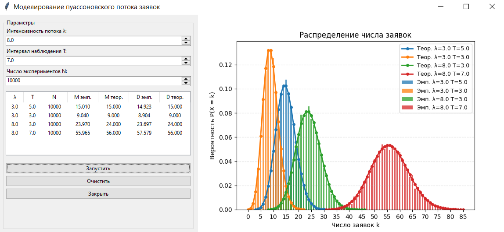

### Пуассоновский поток. События на сервере

**Задание:**
- событие — поступление заявки;
- определить число заявок за интервал времени T;
- построить распределение числа заявок;
- вычислить среднее и дисперсию;
- сделать вывод.

### Описание метода

**Простейший (стационарный пуассоновский) поток**

Поток обладает тремя свойствами:
- **Стационарность** - число событий на интервале зависит только от его длины, но не от начальной точки.
- **Ординарность** - в один момент времени может наступить не более одного события.
- **Независимость** - число событий на непересекающихся интервалах независимо.

Число событий за время T распределено по закону Пуассона:

$$P(X = k) = \frac{(\lambda T)^k}{k!} e^{-\lambda T}$$

**Теоретические характеристики:**
- Среднее: M[X] = λ · T
- Дисперсия: D[X] = λ · T

**Алгоритм моделирования (Алгоритм 1, слайд 11):**

Интервалы между событиями в простейшем потоке имеют экспоненциальное распределение с параметром λ. Поэтому один эксперимент - это генерация последовательных интервалов τ ~ Exp(λ) до тех пор, пока суммарное время не превысит T. Количество наступивших событий - результат эксперимента. Процедура повторяется N раз, после чего вычисляется эмпирическое распределение.

### Результаты (N = 10 000)

| λ | T | N | M эмп. | M теор. | D эмп. | D теор. |
|---|---|---|--------|---------|--------|---------|
| 3.0 | 5.0 | 10000 | 15.010 | 15.000 | 14.923 | 15.000 |
| 3.0 | 3.0 | 10000 | 9.040 | 9.000 | 8.904 | 9.000 |
| 8.0 | 3.0 | 10000 | 23.970 | 24.000 | 23.697 | 24.000 |
| 8.0 | 7.0 | 10000 | 55.965 | 56.000 | 57.579 | 56.000 |

**Пример работы программы**

### Выводы
Моделирование пуассоновского потока заявок выполнено на основе алгоритма генерации интервалов между событиями: интервалы τ ~ Exp(λ) накапливались до достижения времени T, число успевших наступить событий считалось результатом одного эксперимента.

Эмпирическое распределение числа заявок за время T хорошо совпадает с теоретическим распределением Пуассона с параметром μ = λT: на графике столбцы эмпирической частоты практически совпадают с теоретической кривой для всех четырёх наборов параметров.

Незначительные отклонения во всех экспериментах объясняются случайностью выборки при конечном N = 10 000. При увеличении N результаты сходятся к теоретическим.
